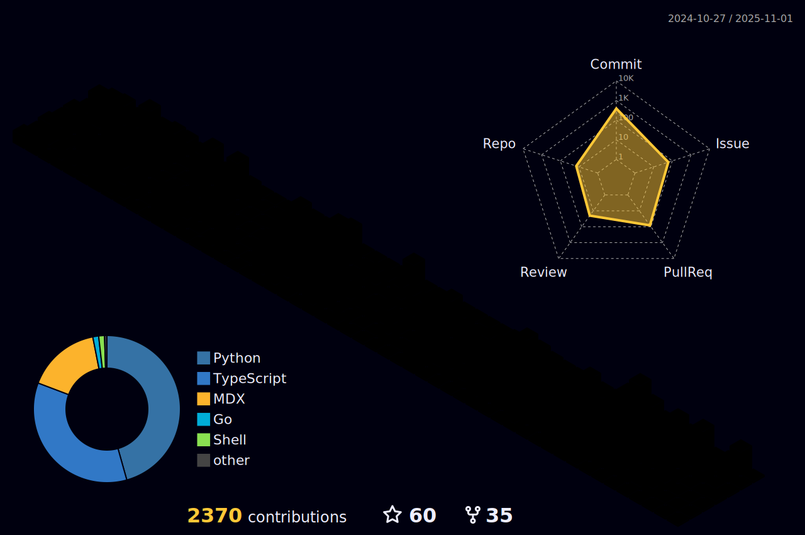

<!-- https://raw.githubusercontent.com/MartinHeinz/MartinHeinz/master/wave.gif 

<h1>  Hello all!  </h1> -->

``` html
                                     		<h1> Hello world! </h1>
```
<!-- <p align=center>

</p> -->
<!-- <h3>Soham here!</h3>  https://user-images.githubusercontent.com/92905626/167291814-f469ad75-182b-42dd-a631-c3a7df977884.jpg 
 -->
<!--

  -->
<!--  -->

<!-- 🔍 [Personal Portfolio website](https://sohamratnaparkhi.github.io/PersonalWebsite_SohamR/)
<br>
📑 [Personal CV](https://sohamratnaparkhi.github.io/SohamR_cv/) -->

## &nbsp;***About me***

- My area of work is diversified into various domains, which mainly include **Full-stack web development**, **Artificial Intelligence**, **Deep Learning** and solving crunch **data structures and algorithm** problems. 
- 👯 I’m looking forward to collaborate on open source projects.
- In my spare time, I do write blogs on [Hashnode](https://hashnode.com/@SohamR) and [leetcode](https://leetcode.com/Soham_R/). 
<!--  - I like participating in coding contests. <br>
    <a href="https://www.codechef.com/users/soham_r"> </a>
    <a href="https://leetcode.com/Soham_R/"></a>
    <a href="https://www.hackerrank.com/soham_ratnapark1"></a> -->
- ✔ Ask me anything, I am happy to help, (only if the ball is in my court!😉)<br>
- Outside tech, I am a decent footballer! `FORÇA BARÇA`⚽
- Here's a link to my **resume** ([Link](https://drive.google.com/file/d/1IDIjbxcYRjMlUF9exNDW19och22R-f4p/view?usp=sharing)) and **portfolio website** ([Link](https://soham-r-portfolio-website.vercel.app))
- <h3> Tech-stack 📜</h3>
<!-- 	1.  Python <br>
	2.  Java <br>
	3.  C / C++ <br>
	4.  HTML, CSS, JS, Bootstrap <br>
	5.  Markdown <br>
	6.  Git and GitHub <br>
	7.  VS Code <br>
	8.  Kotlin <br> 
| General coding |  | | ||
|:---|:---:|:---:|:----:|:--------:|
| **Web Dev.**|  |  |||
|**AI/ ML**|||||
|**Others**|  |  ||
-->


 
 


<!-- Merged 20+ code/low code pull requests during the Hactoberfest period and earned some of their swags as well as this badge.

 [](https://holopin.io/@sohamratnaparkhi) --->

## 🔗 [Contact Me](http://linkfree.eddiehub.org/SohamRatnaparkhi)

[](https://www.linkedin.com/in/soham-ratnaparkhi-3a3775ab/)
[](https://twitter.com/SohamR_7113)
<a href="soham.ratnaparkhi@gmail.com"></a>


## 📊 Github Analytics
 <table>
  <tr>
   
<td>
    <td></td>
  </tr>
</table>


 <!-- <p align="center">
	  
  <br/>
  <b>Note:</b> Top languages is only a metric of the languages my public code consists of and doesn't reflect experience or skill level. -->
  </p> 
  


<details>
   <summary><b>🏆 Github Trophies</b></summary>
<br>

[](https://github.com/ryo-ma/github-profile-trophy)
</details>
<!-- <details>
  <summary><b>📈 My contribution graph </b></summary>
  <br/>
  
   <a href="https://github.com/SohamRatnaparkhi"></a>
  <br/> 
</details> --->


